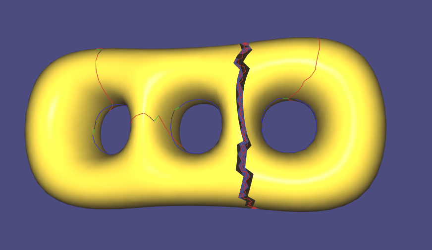

# Tori Decomposition - Mesh processing

Atchuth Naveen Chilaparasetti
  * [LinkedIn](https://www.linkedin.com/in/atchutnaveench/) | [Website](naiveen.github.io)

This code is for finding fundamental cycles and using them to split the mesh into multiple parts of genus 1. The algorithm is presented in the paper [Curvature Aware Fundamental Cycles
](https://www.ics.uci.edu/~gopi/SamplePubs/CurvatureAwareFCycles.pdf) and its extension [Geometry Aware Tori Decomposition
](https://onlinelibrary.wiley.com/doi/full/10.1111/cgf.13641)


##Results

Fundamental Cycles on Fertility model -  Blue cycles represent tunnels and red cycles represent handles


Split one torus and cut mesh on Fertility model -  Using geodesic distace between the blue tunnel cycles a dual cut is found (red) and by removing the edges that the cut pass through, the mesh is split into two parts.


Cut on Triple Torus.



## Evaluation
```bash
#define  primalSpanViewFlag 0  // Setting this flag will show minimum spanning tree found on Primary mesh edges
#define  dualSpanViewFlag 0 // Setting this flag will show minimum spanning tree found on Dual graph mesh edges
#define  FERTILITY 0 // Default model is triple torus. Setting this flag will make the code use Fertility model. 
#define  VISUALIZEHANDLES 1 // To visualize all fundamental cycles both tunnel and handles
#define  CUTMESH 1 // To split the mesh into two parts, one part will be of genus one
```

## Setup Instructions
Please see additional set up instructions at [Libigl Example Project](https://github.com/libigl/libigl-example-project)

```bash
mkdir build
cd build
cmake ..
```

On Windows,
From Visual Studio, open tori.sln file in build/.
Right click on Solution, change starting project to tori.  


## Run

From within the `build` directory just issue:

    ./tori

A glfw app should launch displaying fundamental cycles on fertitlity mesh.
